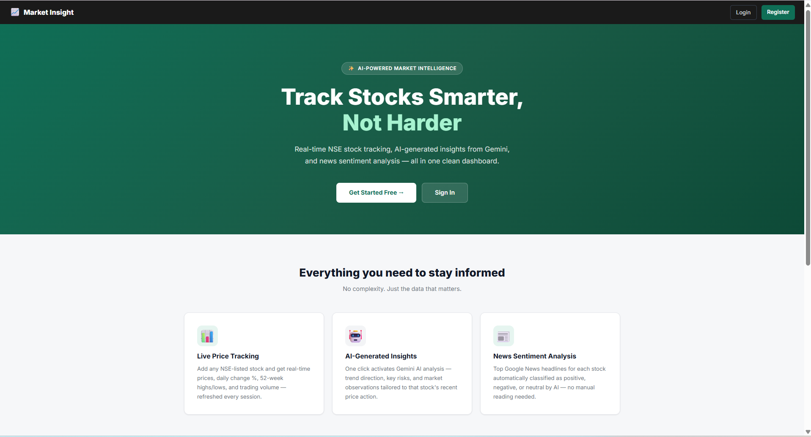
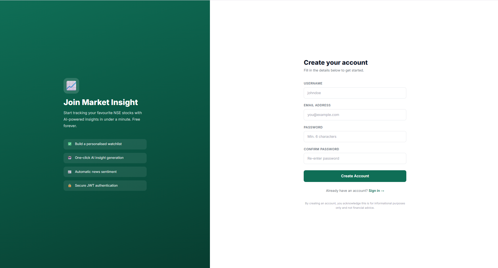
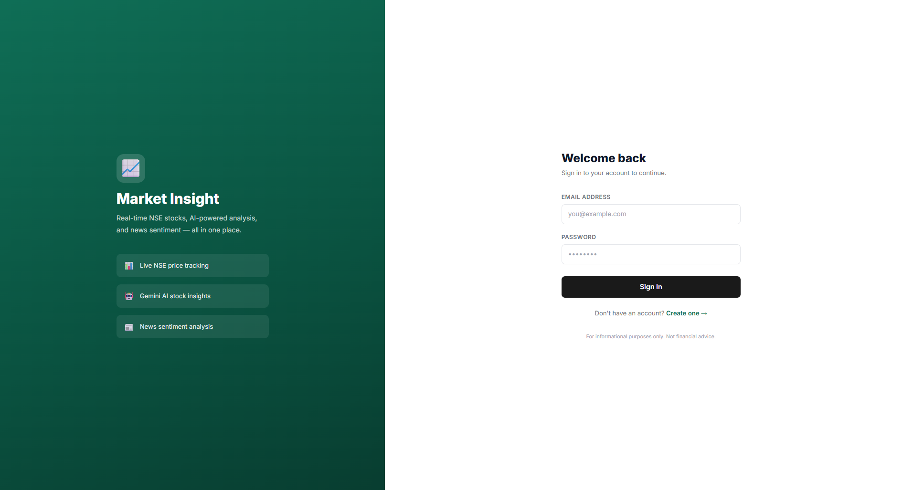
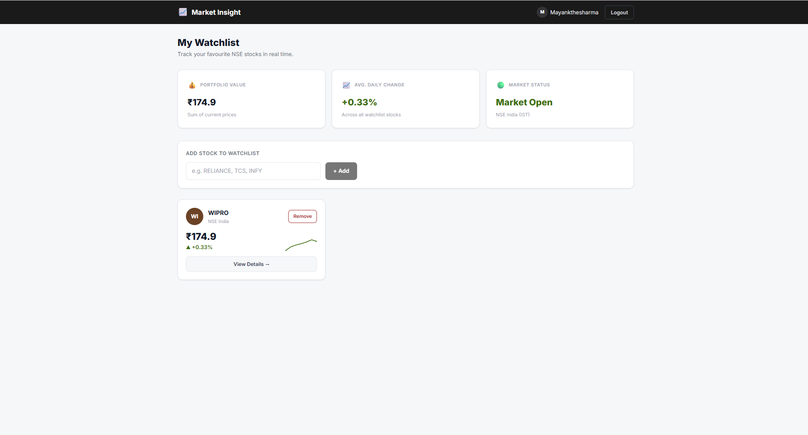
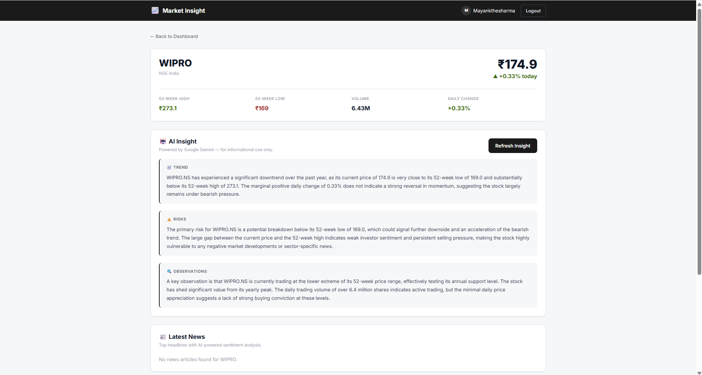

# Market Insight Platform

An AI-powered full-stack platform for analyzing NSE (Indian stock market) stocks — combining live price data, AI-generated insights via Google Gemini, and news sentiment analysis, all behind secure user authentication.

**Live Demo:** https://market-insight-platform.vercel.app
**Backend API Docs:** https://market-insight-platform.onrender.com/docs

---

## Project Overview

Market Insight Platform lets users register, build a personal watchlist of NSE-listed stocks, and view real-time price data alongside AI-generated analysis and news sentiment for each stock — helping users stay informed without manually digging through multiple sources.

---

## Features Implemented

- **Authentication** — Register, login, logout using JWT-based auth with bcrypt password hashing
- **Watchlist Management** — Add, remove, and view stocks in a personal watchlist tied to each user account
- **Stock Detail Page** — Current price, daily change %, 52-week high/low, and trading volume for any NSE-listed stock
- **AI Insight Section** — Gemini-generated summary covering recent trend, potential risks, and key observations for a given stock
- **News Sentiment Analysis** — Top headlines for a stock, each labeled positive/negative/neutral by AI
- **Dashboard** — Portfolio-style stats (total watchlist value, average daily change, market open/closed status), with per-stock cards showing company logo, price, and a mini sparkline trend line
- **FAQ Sections** — One on the landing page (about the platform), and one on each stock detail page (about that specific stock, derived from already-fetched data)
- **Caching layer** — Stock prices, AI insights, and news results are cached in MongoDB to reduce external API load and improve reliability

---

## Technologies Used

**Frontend:** Next.js 14 (App Router), TypeScript, Tailwind CSS
**Backend:** FastAPI (Python), JWT authentication, bcrypt
**Database:** MongoDB Atlas
**AI:** Google Gemini API (gemini-2.5-flash)
**Market Data:** yfinance (Yahoo Finance)
**News:** Google News RSS
**Deployment:** Vercel (frontend), Render (backend)

---

## Setup Instructions

### Backend
    cd backend
    pip install -r requirements.txt
    uvicorn main:app --reload

Runs on http://localhost:8000. Interactive API docs available at /docs.

### Frontend
    cd frontend
    npm install
    npm run dev

Runs on http://localhost:3000.

---

## Environment Variables

**Backend (backend/.env):**

    MONGO_URI=your_mongodb_atlas_connection_string
    JWT_SECRET=any_random_secret_string
    GEMINI_API_KEY=your_gemini_api_key

**Frontend (frontend/.env.local):**

    NEXT_PUBLIC_API_URL=http://localhost:8000

(set to the deployed backend URL in production)

---

## Assumptions & Limitations

- **NSE tickers only** — stock symbols are assumed to be NSE-listed (e.g. RELIANCE, TCS); the .NS suffix is appended automatically.
- **yfinance rate limiting on cloud hosts** — Yahoo Finance rate-limits requests from shared cloud IPs (like Render's), which can affect fetching data for stocks not already cached. To ensure reliability during evaluation, price data for the Nifty 50 stocks has been pre-seeded into the cache. Once any stock's price has been fetched once, it also becomes available for the AI Insight feature (which reuses cached price data rather than calling yfinance a second time).
- **News coverage varies by stock** — Google News RSS coverage differs by company; some stocks may show "no news found" if there's genuinely little recent coverage, handled as a graceful empty state rather than an error.
- **Gemini free-tier quota** — the AI Insight and News Sentiment features use Gemini's free tier (limited daily requests). A 3-hour caching layer minimizes repeated calls for the same stock.
- **Not financial advice** — AI-generated insights are for informational purposes only and should not be treated as investment recommendations.

---

## Screenshots

### Landing Page

### Register

### Login

### Dashboard

### Stock Detail with AI Insight
